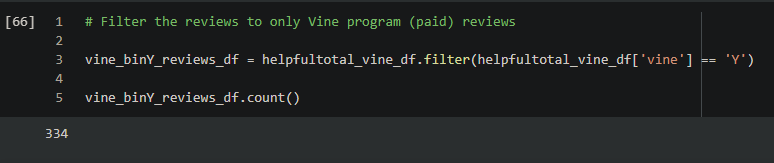
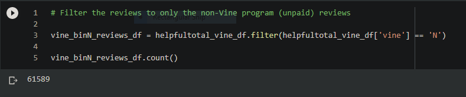
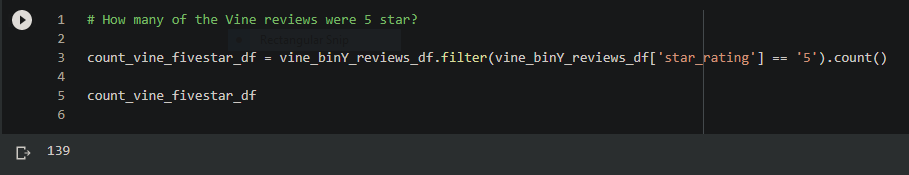
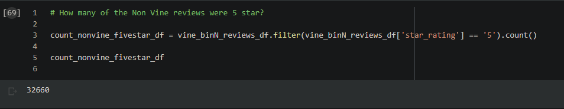
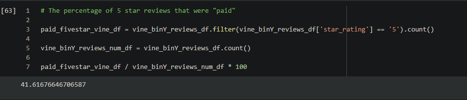
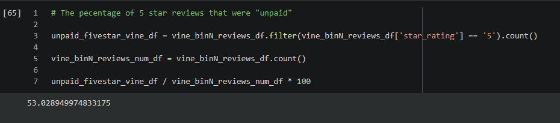

# Amazon_Vine_Analysis

## Overview of the analysis:
For this project I was supplied with and had access to approximately 50 datasets of Amazon.com reviews. Each dataset contained reviews of a specific product category, which ranged across all of Amazon's product categories such as "Toys and Games", or "Home and Office". Using one of these datasets, I was tasked with finding out if there was any positivity bias in the Vine program regarding the reviews by its members.
For this specific analysis the "Sports" category was chosen. PySpark was used to extract that specific dataset, transform it, connect to an AWS RDS database instance I created, and load the transformed data into pgAdmin. Next, PySpark was used to determine if there was any bias toward favorable reviews from Vine members in the Sports dataset versus their non-Vine counterparts.

## Results:

### How many Vine reviews and non-Vine reviews were there?

 
Total Vine Reviews

- As is shown in the example there were 334 total reviews done by Vine program personnel.

 

 
Total Non-Vine Reviews

- In contrast, as is shown, there were 61,589 total reviews done by non-Vine program personnel.

 

### How many Vine reviews were 5 stars? How many non-Vine reviews were 5 stars?

 
5-star Vine Reviews

- Out of the 5-star reviews, 139 of them were Vine reviews.

 

 
5-star Non-Vine Reviews

- For Non-Vine reviews there were 32,660 5-star reviews.

 

### What percentage of Vine reviews were 5 stars? What percentage of non-Vine reviews were 5 stars?

 
Percentage of Vine Reviews

- The percentage of Vine reviews that were 5 star is ~42%.

 

 
Percentage of Non-Vine Reviews

- While the percentage of non-Vine reviews that were 5-star is ~53%.

 

## Summary:

Across the analysis a number of factors come into play when considering if there is any positivity bias for reviews in the Vine program. For this limited analysis the factors that were specifically taken into consideration were the total reviews per group and how they compared to one another by 5-star rating. These numbers couldn't be immediately compared since the review numbers were vastly different. 61,589 (which is the number of unpaid reviews) obviously dwarfs the paid review number of 334, but when divided against their perspective 5-star review total this would produce a percentage. With this percentage you could compare the Vine and Non-Vine percentages on even ground to compare and check for possible positivity bias.

Utilizing Pyspark further, the total of the Vine reviews that were 5-star came out to 139 reviews, and for the non-Vine reviews: 32,660. These numbers where then broken down to the percentages of how many 5-star reviews were out of the total of reviews. The Vine reviews came out to roughly that 42% were 5-star and the non-Vine reviews to roughly 53% that were 5-star.

From a very cursory standpoint the biggest observation is that for this dataset the non-Vine reviewers were actually more likely to be experiencing a form of positivity bias versus their Vine counterparts. While this really has no grounds to support this, since the percentages are both so close to one another and barely hovering around 50%, it is just barely shown that non-Vine members voted 5-stars on average more than the Vine members. So, taking this all into consideration, there does not seem to be bias from the Amazon Vine community, or at least not enough evidence to say the reviews do have positivity bias.

Again, this is still incredibly hard to really even make that observation. To further this analysis, and possibly even get to more concrete results, a breakdown of the complete rating scale could be done, instead of just focusing on 5 stars. Positivity bias can be exemplified better if we compare all of the data, instead of just a piece of the data. For instance, maybe we'd find that Vine members seemed to vote very often in the 3-4 ranges, versus non-Vine members who were willing to vote 1 on something if necessary. Other considerations, such as sample sizes, and other metrics captured by the datasets could be used to make a more complete answer. In conclusion, while positivity bias was not discovered, the groundwork to find it was established.
